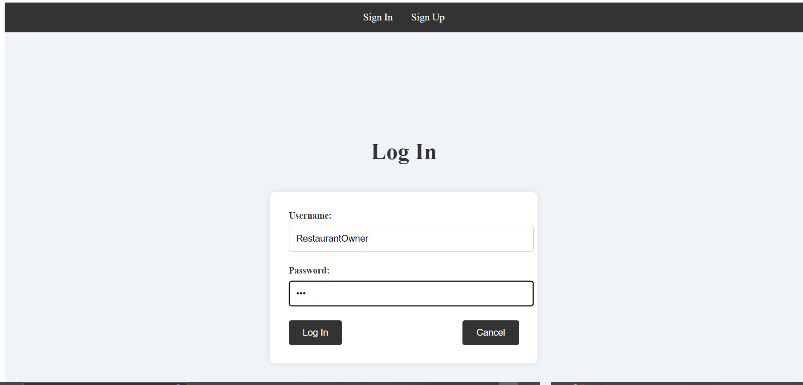
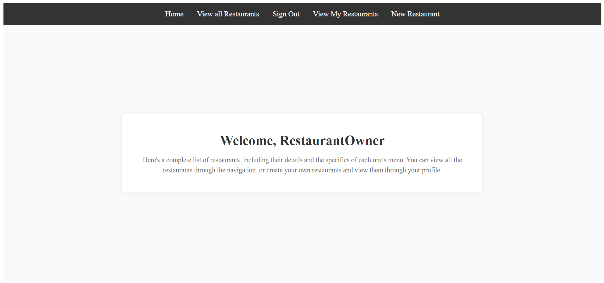
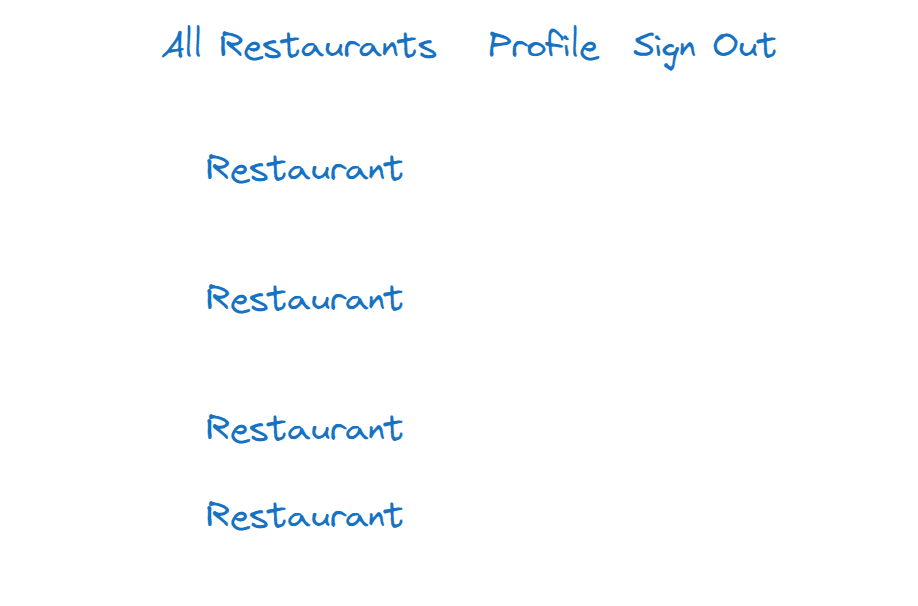
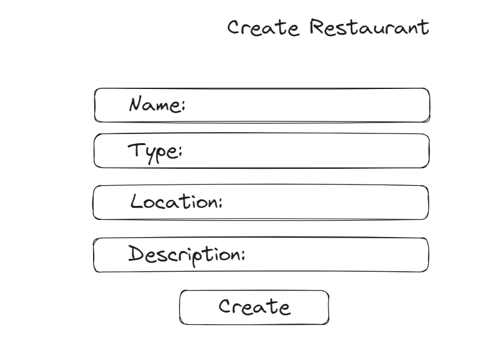
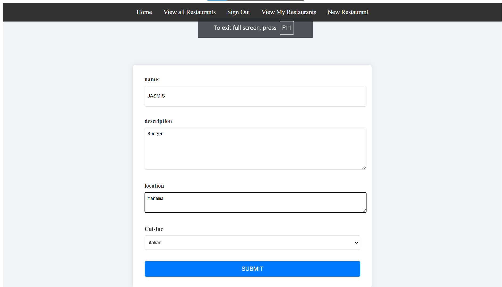
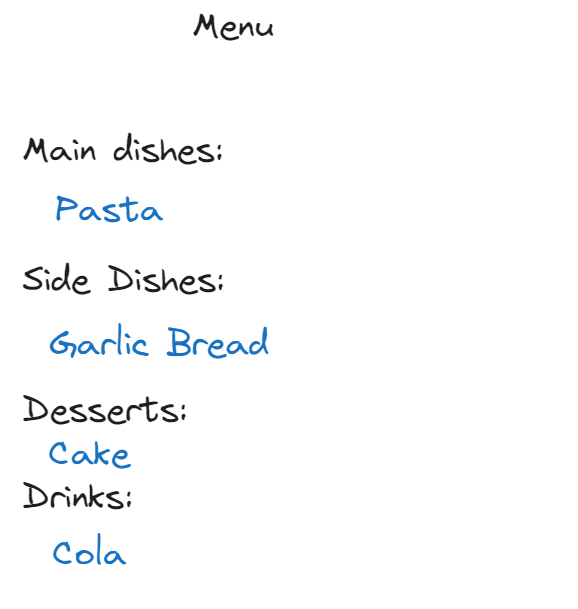
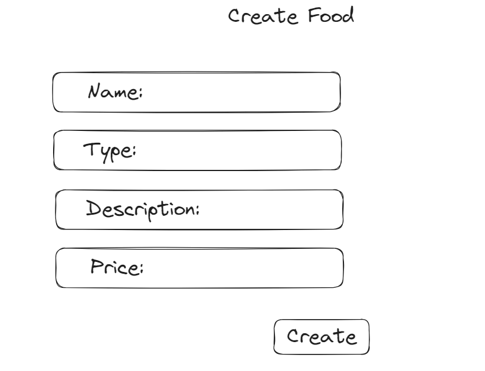
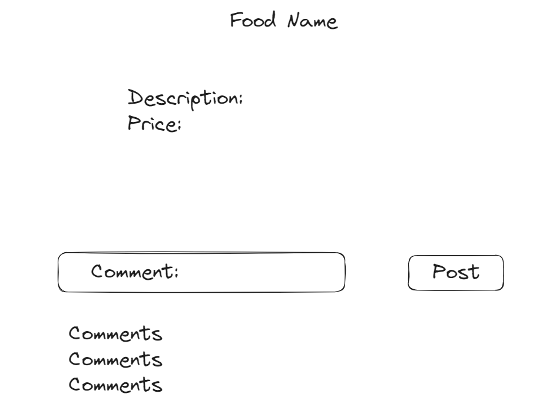

# Eatery Explorer

## Date: 22/8/2024

## website description :
the Eater Explorer is a website where users can find various restaurants with various cuisines , and the could view their informations , beside being able to comment on the restaurant to leave a review for other users , "perhaps we will implement add to favourites for users so they could have their own favourite restaurants and maybe we will implement another favourite to be for the foods , also if we had time we will try o implement rating system to count the averegee of users rating for restaurant".

## Instructions
The user must sign up, and then sign in with the same username and password, each user can add his own restaurant along with it's details (restaurant name, cuisine, location, and description), also he can add food menu in each restaurant along with it's details(food name, type, price and description), the owner of the restaurant can edit the details of the restaurant and food, and he can delete them. Also each user can view the list of all the restaurants and add comments on the restaurant as well as adding comments on the food, each user can delete his own comment. In addition, the owner of the restaurant can view the list of the restaurants that he owns along with it's details, also he can view the food menu of each restaurant he owns along with it's details.

## ERD:

## user stories :

* as a user i should be able to sign up and sign in .
* as a user i should be able to view the restaurants in the website .
* as a user i should be able to view restaurants menu / foods .
* as a user i should be to create a restaurant and should be the .only one capable of adding foods to the restaurant menu , (being a user and owner of the restaurant) .
* as a user i should be to edit the menu of my restaurant / edit the restaurant or delete .

## Technologies used
* React for front-end
* JavaScript(express.js,node.js) for backend
* Heroku and vercel for deployment
* MongoDB for the database
* CSS for styling
* [Trello for planning](https://trello.com/b/fWjFv1X9/eatery)

## Wire Frame: 
### Sign Up:

### Sign In:

### Landing Page:

### Create Restaurant:

### Restaurant Details:

### Menu:

### Create Food:

### Food Details:

## Difficulties
* Displaying the name of the owner of each restaurant
* Collaborating issues(Using github for merging the work)

## Future enhancements
* Making a favorite list for the users
* Making reviews for the users

## Credits
* Refering to the hoot lab template
* MDN Documentations
